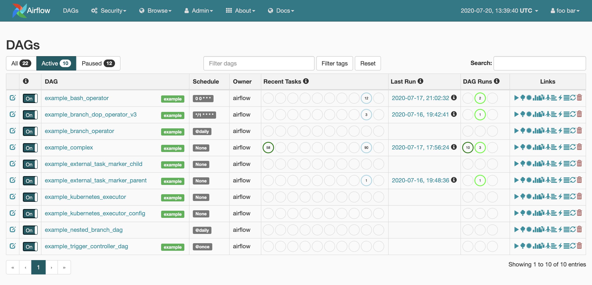
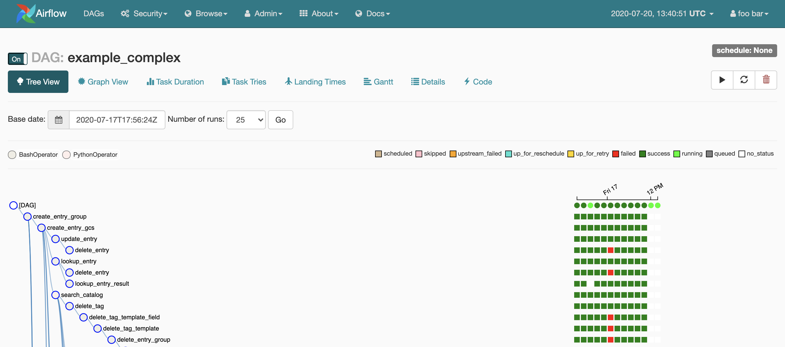
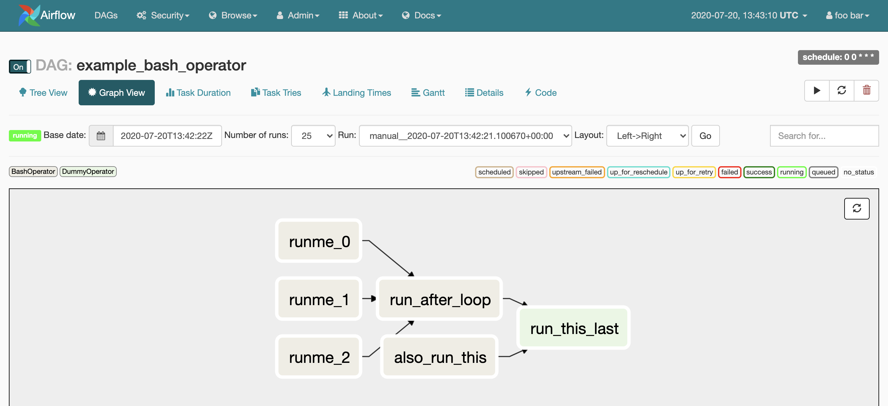
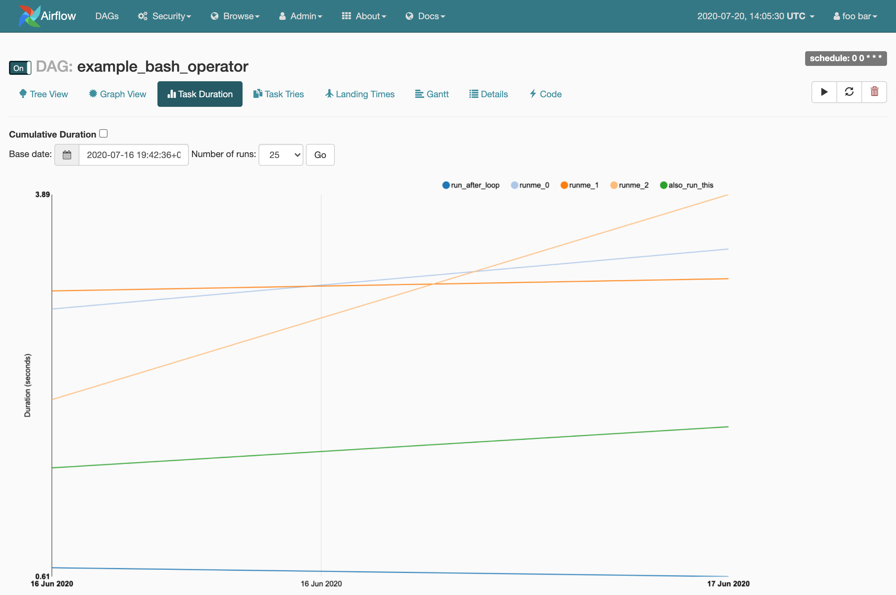
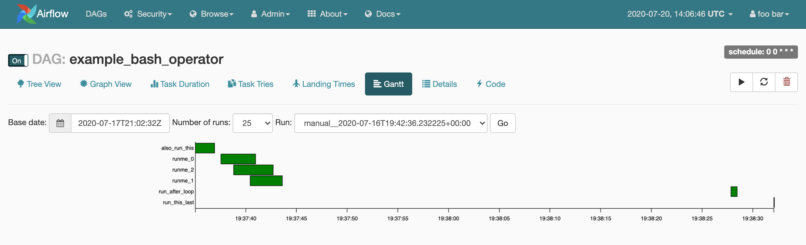
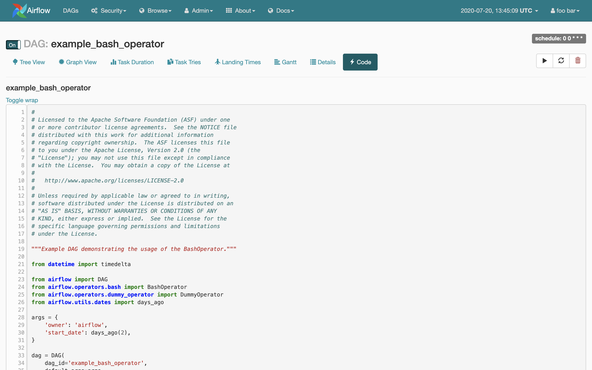

# FlowXpert Engine (Airflow)

## Table of Contents

-   [About the Project](#about-the-project)
-   [Getting Started](#getting-started)
    -   [Prerequisites](#prerequisites)
-   [User Interface](#user-interface)
-   [Usage](#usage)
    -   [Test Setup](#test-setup)
        -   [UI Links](#ui-links)
        -   [Scale the number of workers](#scale-the-number-of-workers)
        -   [Running other airflow commands](#running-other-airflow-commands)
        -   [Simplified Celery broker configuration using Redis](#simplified-celery-broker-configuration-using-redis)
    -   [Stable Setup](#stable-setup)
        -   [Manual Installation](#manual-installation)
        -   [Helm Deployment](#helm-deployment)
-   [Release History](#release-history)
-   [Roadmap](#roadmap)
-   [Contribution Guidelines](#contribution-guidelines)
-   [Issues?](#issues)
-   [Acknowledgements](#acknowledgements)
-   [Maintainer](#maintainer)

## About The Project
Customized engine based on [Airflow](https://airflow.apache.org/) that automatically registers tailormade workflows published on the Workflow Designer.

-   Reads specialized json file from `AWS S3 bucket` thats is converted to pythonic code and gets registered as executable DAG (Directed Acyclic Graph) on the Airflow UI.
-   Based on `Python (3.7-slim-buster)` official Image [python:3.7-slim-buster](https://hub.docker.com/_/python/) and uses `AWS RDS (MySQL)` as backend and `RabbitMQ` as queue that runs on top of Kubernetes Cluster residing in `AWS EKS`. 

## Getting Started
Please visit the Airflow Platform documentation (latest **stable** release) for help with [installing Airflow](https://airflow.apache.org/installation.html), getting a [quick start](https://airflow.apache.org/start.html), or a more complete [tutorial](https://airflow.apache.org/tutorial.html).

### Prerequisites

-   [Git](https://git-scm.com/downloads)
-   [Airflow](https://airflow.apache.org/)
-   [Docker](https://www.docker.com/)
-   [Docker Compose](https://docs.docker.com/compose/install/)
-   [Kubernetes](https://kubernetes.io/)

## User Interface
- **DAGs**: Overview of all DAGs in your environment.

  

- **Tree View**: Tree representation of a DAG that spans across time.

  

- **Graph View**: Visualization of a DAG's dependencies and their current status for a specific run.

  

- **Task Duration**: Total time spent on different tasks over time.

  

- **Gantt View**: Duration and overlap of a DAG.

  

- **Code View**:  Quick way to view source code of a DAG.

  

## Usage

### Test Setup 
##### Note: 
>   Test setup uses Redis as broker for CeleryExecutor

Follow the commands to setup environment in your local machine

    git clone https://<username>@bitbucket.org/team360noscope/airflow-experimental.git
    
    docker build -f Dockerfile-test -t puckel/docker-airflow .

Don't forget to update the airflow images in the docker-compose files to puckel/docker-airflow:latest.

By default, docker-airflow runs Airflow with **SequentialExecutor** :

    docker run -d -p 8080:8080 puckel/docker-airflow webserver

If you want to run another executor, use the other docker-compose.yml files provided in this repository.

For **LocalExecutor** :

    docker-compose -f docker-compose-LocalExecutor.yml up -d

For **CeleryExecutor** :

    docker-compose -f docker-compose-CeleryExecutor.yml up -d

NB : If you want to have DAGs example loaded (default=False), you've to set the following environment variable :

`LOAD_EX=n`

    docker run -d -p 8080:8080 -e LOAD_EX=y puckel/docker-airflow

####  UI Links

- Airflow: [localhost:8080](http://localhost:8080/)
- Flower: [localhost:5555](http://localhost:5555/) (If running with CeleryExecutor)

####  Scale the number of workers

Easy scaling using docker-compose:

    docker-compose -f docker-compose-CeleryExecutor.yml scale worker=5

This can be used to scale to a multi node setup using docker swarm.

#### Running other airflow commands

If you want to run other airflow sub-commands, such as `list_dags` or `clear` you can do so like this:

    docker run --rm -ti puckel/docker-airflow airflow list_dags

or with your docker-compose set up like this:

    docker-compose -f docker-compose-CeleryExecutor.yml run --rm webserver airflow list_dags

You can also use this to run a bash shell or any other command in the same environment that airflow would be run in:

    docker run --rm -ti puckel/docker-airflow bash
    docker run --rm -ti puckel/docker-airflow ipython

> When specifying the connection as URI (in AIRFLOW_CONN_* variable) you should specify it following the standard syntax of DB connections,
> where extras are passed as parameters of the URI (note that all components of the URI should be URL-encoded).

Therefore you must provide extras parameters URL-encoded, starting with a leading `?`. For example:

    POSTGRES_EXTRAS="?sslmode=verify-full&sslrootcert=%2Fetc%2Fssl%2Fcerts%2Fca-certificates.crt"

#### Simplified Celery broker configuration using Redis

If the executor type is set to *CeleryExecutor* you'll need a Celery broker. Here is a list of Redis configuration variables
and their default values. They're used to compute the `AIRFLOW__CELERY__BROKER_URL` variable for you if you don't provide
it explicitly:

| Variable          | Default value | Role                           |
|-------------------|---------------|--------------------------------|
| `REDIS_PROTO`     | `redis://`    | Protocol                       |
| `REDIS_HOST`      | `redis`       | Redis server host              |
| `REDIS_PORT`      | `6379`        | Redis server port              |
| `REDIS_PASSWORD`  | empty         | If Redis is password protected |
| `REDIS_DBNUM`     | `1`           | Database number                |

You can also use those variables to adapt your compose file to match an existing Redis instance managed elsewhere.

### Stable Setup 
>   With Kubernetes, Helm Chart, & AWS EKS

#### Manual Installation
Create all the deployments and services to run Airflow on Kubernetes:

    kubectl apply -f deployment.yaml
    
This will create deployments for: 
-   rabbitmq
-   airflow-webserver
-   airflow-scheduler
-   airflow-flower
-   airflow-worker

and services for:
-   rabbitmq
-   airflow-webserver
-   airflow-scheduler

Port-Forward the service of webserver to access the application

    kubectl port-forward service/<airflow-webserver-service-name> 8080:8080 --address:<private-ip-of-server>

#### Helm Deployment 
>   Deployment recommended via CI-CD pipeline

Ensure your helm installation is done, and enter the following command

    helm install ./helm-chart --generate-name

Follow the `notes` generated at the end of helm deployment for more instructions

## Releases
>   Contains all the git tag releases/issue fixes

>   [Releases](https://bitbucket.org/team360noscope/airflow-experimental/src/master/Releases.md)

## Roadmap

> [RoadMap](https://bitbucket.org/team360noscope/airflow-experimental/src/master/RoadMap.md) contains all the `Issues` & `TODOs`

## Contribution Guidelines
-   Fork
-   Pick up an issue or check TODOs
-   Write test cases/add or improve feature(s)
-   Send pull requests

## Issues?
-   Contact Repo admin or maintainers

## Acknowledgements
-   [Apache Airflow](https://airflow.apache.org/)
-   [Puckel](https://github.com/puckel/docker-airflow)

## Maintainer
-   [neilharia7](https://github.com/neilharia7)